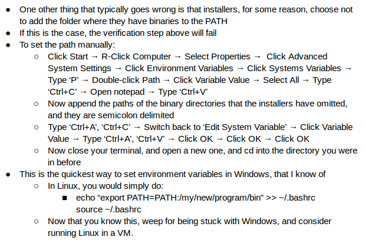

So I was tasked with documenting how to set up a development environment in Windows.

Here is my favourite part:

I hope that I have captured the essence of the frustrations that come with developing on Windows!
